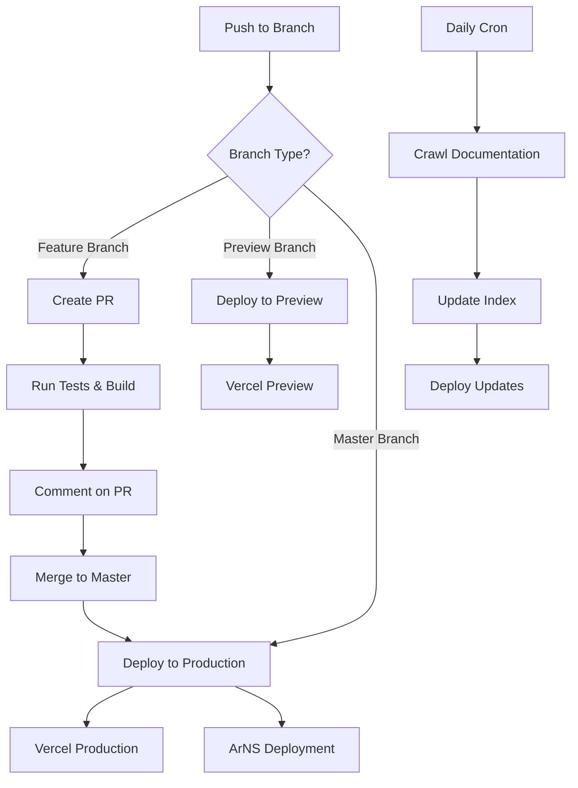

# 🚀 Permaweb LLMs Builder

An interactive tool for selecting and curating Permaweb documentation into `llms.txt` format for AI training.

## 🎯 Features

- 🌐 **Multi-site crawling**: Automatically crawl documentation from Hyperbeam, AO, ArIO, and core Arweave sites
- 🎯 **Smart filtering**: Quality scoring and content enhancement for optimal AI training data
- 📊 **Interactive selection**: Browse and filter documentation with real-time search
- 📄 **LLMs.txt generation**: Export curated content in the standard format for AI training
- 📱 **Responsive design**: Works on desktop and mobile devices
- 🚀 **Multiple deployment options**: Deploy to Vercel or Arweave with flexible configurations

## 🏗️ Development Setup

### Prerequisites

- **Bun** (v1.0+) - [Install Bun](https://bun.sh/docs/installation)
- **Node.js** (v18+) - For fallback compatibility
- **Git** - For version control

### Quick Start

```bash
# Clone the repository
git clone https://github.com/your-org/permaweb-llms-builder.git
cd permaweb-llms-builder

# Install dependencies
bun install

# Start development server
bun run dev

# Open in browser
open http://localhost:4321
```

### Available Scripts

```bash
# Development
bun run dev              # Start development server
bun run preview          # Preview production build locally
bun run preview:local    # Preview with custom server

# Building
bun run build            # Build for production
bun run build:vercel     # Build for Vercel deployment
bun run clean            # Clean build artifacts

# Testing
bun run test             # Run tests once
bun run test:watch       # Run tests in watch mode
# Add --ui or --coverage flags as needed:
# bun run test --ui       # Run tests with UI
# bun run test --coverage # Run tests with coverage

# Linting & Validation
bun run lint             # Run Astro linter
bun run validate         # Run tests + lint + build

# Documentation Crawling
bun run crawl            # Show help and crawl all sites (pretty JSON)
bun run crawl:prod       # Crawl all sites (minified JSON for production)
bun run crawl <site>     # Crawl specific site (hyperbeam, ao, ario, arweave)
bun run crawl --force    # Force reindex all sites
bun run crawl <site> --force  # Force reindex specific site

# Deployment (via GitHub Actions)
bun run deploy:preview   # Deploy to preview (push to preview branch)
bun run deploy:prod      # Deploy to production (push to main branch)
```

## 🚀 CI/CD Pipeline

This repository uses a comprehensive CI/CD pipeline for automated testing, building, and deployment.

### Workflow Overview



### Environment Structure

| Environment | Platform | URL | Deployment |
|-------------|----------|-----|------------|
| **Development** | Local | `localhost:4321` | Manual (`bun run dev`) |
| **Preview** | Vercel | Vercel preview URLs | Manual (`bun run deploy:preview`) |
| **Production** | Arweave | `permaweb-llms-builder.ar.io` | Manual (`bun run deploy:prod`) |

### GitHub Actions Workflows

#### 1. Main Deployment Pipeline (`.github/workflows/deploy.yml`)

**Triggers:**
- Pull requests to `master`
- Pushes to `master` or `preview` branches
- Manual workflow dispatch

**Jobs:**
- **test-and-build**: Validates PRs and feature branches
- **deploy**: Deploys to preview or production environments
- **cleanup**: Maintains workflow history

#### 2. Daily Documentation Crawl (`.github/workflows/daily-crawl-deploy.yml`)

**Triggers:**
- Daily at 2 AM UTC
- Manual trigger

**Process:**
1. Crawls all configured documentation sites
2. Generates fresh documentation index
3. Uploads index to dedicated ArNS endpoint
4. Reports crawl statistics

### Deployment Commands

#### Preview Deployment (Vercel)
```bash
# Deploy to Vercel for fast iteration and testing
bun run deploy:preview
```

#### Production Deployment (Arweave)
```bash
# Deploy to permanent Arweave storage
bun run deploy:prod
```

#### Interactive Deployment
```bash
# Choose deployment target interactively
bun run deploy
# Select: 1) Preview (Vercel) or 2) Production (Arweave)
```

### Required GitHub Secrets

Configure these secrets in your GitHub repository settings:

```bash
# Vercel Deployment
VERCEL_TOKEN=your_vercel_token
VERCEL_ORG_ID=team_6GvOyT5ARQJH1mo4x6fXQqzE
VERCEL_PROJECT_ID=prj_eFRPzU5WfC6v7l4GNqrtzkSUqdcT

# ArNS Deployment (when enabled)
DEPLOY_KEY=your_arweave_wallet_jwk
ANT_PROCESS=your_ant_process_id
```

## 📁 Project Structure

```
permaweb-llms-builder/
├── .github/
│   └── workflows/           # CI/CD workflows
├── public/                  # Static assets
│   ├── crawl-config.json   # Crawl configuration
│   ├── docs-index.json     # Generated documentation index
│   └── favicon.svg
├── scripts/                 # Build and deployment scripts
│   ├── deploy-preview.sh    # Preview deployment
│   ├── deploy-production.sh # Production deployment
│   └── post-build.js       # Post-build optimization
├── src/
│   ├── pages/              # Astro pages
│   ├── styles/             # CSS styles
│   └── utils/              # Utility functions
│       ├── crawler.js      # Documentation crawler
│       ├── content-enhancer.js
│       ├── quality-scorer.js
│       └── batch-processor.js
├── test/                   # Test files
├── astro.config.mjs        # Astro configuration
├── package.json           # Dependencies and scripts
├── preview-server.js      # Development preview server
└── vitest.config.js       # Test configuration
```

## 🧪 Testing

The project uses Vitest for testing with jsdom environment for DOM testing.

```bash
# Run all tests
bun run test

# Watch mode for development
bun run test:watch

# Run with coverage
bun run test:coverage

# Interactive UI
bun run test:ui
```

### Test Categories

- **Unit Tests**: Individual function testing
- **Integration Tests**: Component interaction testing
- **Crawler Tests**: Documentation crawling validation
- **Content Tests**: Quality scoring and enhancement validation

## 🔧 Configuration

### Crawl Configuration (`public/crawl-config.json`)

Configure documentation sources:

```json
{
  "hyperbeam": {
    "url": "https://docs.hyperbeam.xyz",
    "selectors": {
      "content": "main",
      "title": "h1"
    }
  }
}
```

### Build Configuration (`astro.config.mjs`)

Astro configuration for static site generation:

```javascript
export default defineConfig({
  output: 'static',
  build: {
    inlineStylesheets: 'always'
  }
});
```

## 🌐 Deployment

### Vercel Deployment

The project deploys to Vercel for both preview and production environments:

- **Preview**: Automatic deployment on `preview` branch pushes
- **Production**: Automatic deployment on `master` branch pushes

### ArNS Deployment (Coming Soon)

Future deployment to Arweave Permaweb with ArNS:

```bash
# Will be enabled when ready
npx permaweb-deploy \
  --arns-name=permaweb-llms-builder \
  --ant-process=$ANT_PROCESS \
  --deploy-folder=dist
```

## 🤝 Contributing

### Development Workflow

1. **Fork the repository**
2. **Create a feature branch**: `git checkout -b feature/amazing-feature`
3. **Make your changes**
4. **Run tests**: `bun run validate`
5. **Commit changes**: `git commit -m 'Add amazing feature'`
6. **Push to branch**: `git push origin feature/amazing-feature`
7. **Create Pull Request**

### Code Standards

- Use **kebab-case** for file names
- Use **camelCase** for variables and functions
- Use **PascalCase** for classes and constructors
- Write tests for new functionality
- Follow existing code style and patterns

### Commit Messages

Use conventional commit format:

```
feat: add new documentation source
fix: resolve crawler timeout issue
docs: update deployment instructions
test: add unit tests for quality scorer
```

## 📊 Monitoring

### Build Status

Monitor deployment status:
- GitHub Actions: Check workflow runs
- Vercel Dashboard: Monitor deployments
- Error Tracking: Review build logs

### Performance Metrics

- Build time optimization
- Bundle size monitoring
- Crawl success rates
- Site performance metrics

## 🔗 Links

- **Live Site**: [Your Production URL]
- **Preview Environment**: [Your Preview URL]
- **Documentation**: [Your Docs URL]
- **Issues**: [GitHub Issues](https://github.com/your-org/permaweb-llms-builder/issues)

## 📄 License

This project is licensed under the MIT License - see the [LICENSE](LICENSE) file for details.

---

Built with ❤️ for the Permaweb ecosystem

### Architecture

The Permaweb LLMs Builder uses a streamlined approach for documentation indexing:

- **📁 Public Access**: `public/docs-index.json` - Accessible at `/docs-index.json` for frontend consumption and external API access
- **🔄 Automatic Generation**: Crawl processes generate and maintain the index file automatically
- **⚡ Optimized Loading**: Frontend loads the index via fetch for dynamic content rendering

This simplified structure eliminates redundancy while maintaining all functionality.
